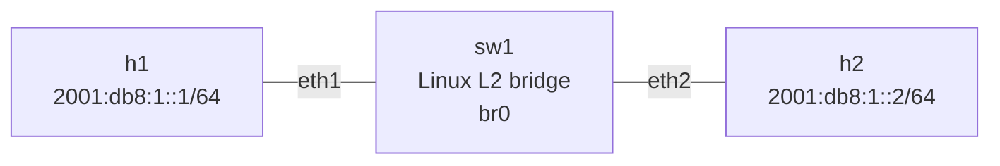

# IPv6 Neighbor Discovery (ND)

This lab focuses on IPv6 Neighbor Discovery at Layer 2: IPv6 addressing, link-local addresses, solicited-node multicast, Neighbor Solicitation/Advertisement, neighbor cache, NUD, DAD, and Router Solicitation observation.

## Topology



All three nodes share one Layer-2 domain. `sw1` is a Linux bridge, not an IPv6 router.

## What ND is for

IPv6 does not use ARP. Neighbor Discovery uses ICMPv6 and provides:

- IPv6-to-link-layer address resolution
- Neighbor Advertisement
- Duplicate Address Detection (DAD)
- Router discovery
- Prefix/router information
- Neighbor Unreachability Detection (NUD)
- Redirects

The core address-resolution exchange is:

```text
Neighbor Solicitation (NS)  ->  "Who has this IPv6 address?"
Neighbor Advertisement (NA) ->  "That is me; here is my MAC."
```

## IPv6 notation

IPv6 is 128 bits = 16 bytes = 8 groups of 16 bits.

Full form:

```text
2001:0db8:0001:0000:0000:0000:0000:0001
```

Leading zeros inside a hextet can be removed:

```text
2001:db8:1:0:0:0:0:1
```

One consecutive run of zero hextets can be replaced by `::`:

```text
2001:db8:1::1
```

`::` may occur at most once.

Each hextet is 16 bits = 2 bytes.

## Link-local addresses

IPv6 interfaces automatically have a link-local address, normally from `fe80::/64`.

Example:

```text
fe80::a8c1:abff:fece:c972/64
```

Link-local addresses are used for communication scoped to the local link and are fundamental to IPv6 control-plane mechanisms such as ND.

## Solicited-node multicast

Each IPv6 unicast address has a corresponding solicited-node multicast address.

Format:

```text
ff02::1:ffXX:XXXX
```

The final 24 bits come from the IPv6 address.

For:

```text
2001:db8:1::1
```

the final 24 bits are `00:00:01`, producing:

```text
ff02::1:ff00:1
```

The corresponding Ethernet multicast MAC is:

```text
33:33:ff:00:00:01
```

Linux automatically joins these multicast groups when IPv6 addresses are configured. Inspect them with:

```bash
ip maddr show dev eth1
```

This is multicast addressing, not a new VLAN or broadcast domain.

## Neighbor Solicitation

An NS is ICMPv6 type 135.

Example observed in Wireshark:

```text
Type: Neighbor Solicitation (135)
Target Address: 2001:db8:1::2
Source link-layer address: aa:c1:ab:f7:ea:ed
```

For target `2001:db8:1::2`, the solicited-node destination is:

```text
ff02::1:ff00:2
```

The Source Link-Layer Address option identifies the sender's MAC.

## Neighbor Advertisement

An NA is ICMPv6 type 136.

Example observed:

```text
Type: Neighbor Advertisement (136)

Router: Not set
Solicited: Set
Override: Set

Target Address: 2001:db8:1::2
Target link-layer address: aa:c1:ab:22:f6:1f
```

The flags are:

```text
R S O | reserved
```

- `R` — sender is a router
- `S` — response to a solicitation
- `O` — advertisement may override an existing link-layer mapping
- remaining bits — reserved

The NS's Source Link-Layer Address describes the sender. The NA's Target Link-Layer Address describes the advertised neighbor.

## Neighbor cache

Inspect it with:

```bash
ip -6 neigh show dev eth1
```

Conceptually an entry is:

```text
IPv6 neighbor + interface -> MAC + reachability state
```

For example:

```text
2001:db8:1::2 dev eth1 lladdr aa:c1:ab:22:f6:1f STALE
```

The interface matters. The source IPv6 address that triggered resolution is not the neighbor's identity.

## NUD

NUD means Neighbor Unreachability Detection.

Useful states:

| State | Meaning |
|---|---|
| INCOMPLETE | Resolution is in progress |
| REACHABLE | Recently confirmed reachable |
| STALE | MAC is known, but reachability is not recently confirmed |
| DELAY | Waiting briefly for normal traffic to confirm a stale entry |
| PROBE | Actively probing |
| FAILED | Could not confirm |
| PERMANENT | Static/manual |

Typical flow:

```text
INCOMPLETE -> REACHABLE -> STALE
                         -> DELAY -> REACHABLE
```

`STALE` does not mean the MAC is known to be wrong.

Flush the IPv6 neighbor table in this Alpine lab with:

```bash
ip -6 neigh flush dev eth1
```

## DAD

IPv6 Duplicate Address Detection uses Neighbor Solicitation.

The node tests an address before claiming it. The IPv6 source is the unspecified address:

```text
::
```

This parallels the IPv4 ARP probe:

```text
IPv4: 0.0.0.0 -> "Is anyone using 10.0.0.1?"
IPv6: ::       -> "Is anyone using this IPv6 address?"
```

## Router Solicitation

A host can ask for routers using Router Solicitation.

The all-routers link-local multicast group is:

```text
ff02::2
```

Example:

```text
fe80::... -> ff02::2
ICMPv6 Router Solicitation
```

This lab observes RS but does not configure an IPv6 router or demonstrate RA/SLAAC. That belongs in the next concept lab.

## Useful commands

```bash
ip -6 addr show dev eth1
ip -6 route
ip -6 neigh show dev eth1
ip -6 neigh flush dev eth1
ip maddr show dev eth1
```

Capture ND:

```bash
tcpdump -nni br0 icmp6
```

Save a capture:

```bash
tcpdump -nni br0 -w /tmp/nd.pcap 'icmp6'
```

Generate traffic:

```bash
ping -6 -c 1 2001:db8:1::2
```

## Observed packet flow

```text
H1
2001:db8:1::1
    |
    | NS: target 2001:db8:1::2
    | dst ff02::1:ff00:2
    v
H2
2001:db8:1::2
    |
    | NA: target 2001:db8:1::2
    | MAC aa:c1:ab:22:f6:1f
    v
H1
    |
    | IPv6 Echo Request
    v
H2
    |
    | IPv6 Echo Reply
    v
H1
```

The core path is:

```text
IPv6 destination
      -> Neighbor Discovery
      -> neighbor cache
      -> destination MAC
      -> Ethernet forwarding
```

## Key takeaways

1. IPv6 does not use ARP.
2. ND uses ICMPv6.
3. NS solicits neighbor information.
4. NA advertises neighbor information.
5. Solicited-node multicast replaces IPv4-style broadcast ARP for normal neighbor discovery.
6. Linux automatically joins the corresponding multicast groups.
7. The neighbor cache is scoped by interface and tracks reachability.
8. NUD explains states such as REACHABLE, STALE, DELAY, and PROBE.
9. DAD uses NS with source `::`.
10. RS/RA extends ND into router discovery and host configuration.

## Next concept

Create the next concept lab as:

```text
003-ra-ipv6-routing
```

That lab will introduce an actual IPv6 router and cover:

```text
RS -> RA -> prefix information -> default router -> SLAAC -> IPv6 routing
```
