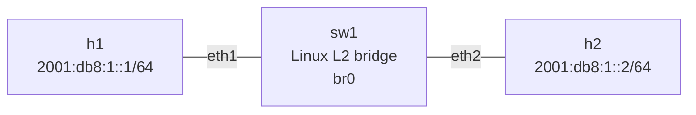
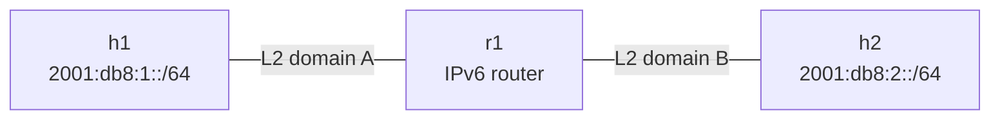

# IPv6 Neighbor Discovery — Topology

## Purpose

This is the Layer-2 IPv6 Neighbor Discovery topology.

It deliberately keeps `sw1` as a Linux L2 bridge so the focus stays on:

- IPv6 addressing
- link-local addresses
- solicited-node multicast
- NS/NA
- neighbor cache
- NUD
- DAD
- Router Solicitation

Routing between separate IPv6 networks is intentionally not part of this topology.

## Topology



## Addressing

| Node | Interface | IPv6 |
|---|---|---|
| h1 | eth1 | `2001:db8:1::1/64` |
| h2 | eth1 | `2001:db8:1::2/64` |
| sw1 | br0 | link-local only for this lab |

The Alpine containers also have their Containerlab/Docker management interface on `eth0`.

## Why this is an L2 topology

On `sw1`:

```text
eth1 ─┐
      ├── br0
eth2 ─┘
```

Both physical ports are enslaved to the Linux bridge:

```text
eth1 master br0
eth2 master br0
```

Therefore:

- `sw1` is not routing between h1 and h2.
- h1 and h2 are in the same IPv6 `/64`.
- h1 can resolve h2 directly with ND.
- No router is required for h1 <-> h2.

## ND packet path

```text
                    Neighbor Solicitation
h1 ------------------------------------------------> h2
    dst IPv6 = ff02::1:ff00:2
    target   = 2001:db8:1::2

                    Neighbor Advertisement
h1 <------------------------------------------------ h2
    target = 2001:db8:1::2
    MAC    = h2's MAC
```

## Solicited-node multicast

For:

```text
2001:db8:1::2
```

the last 24 bits are:

```text
00:00:02
```

so the solicited-node multicast address is:

```text
ff02::1:ff00:2
```

and its Ethernet multicast MAC is:

```text
33:33:ff:00:00:02
```

For h1:

```text
2001:db8:1::1
```

the solicited-node multicast address is:

```text
ff02::1:ff00:1
```

and the Ethernet multicast MAC is:

```text
33:33:ff:00:00:01
```

Inspect memberships with:

```bash
ip maddr show dev eth1
```

## Useful inspection commands

```bash
ip -6 addr show dev eth1
ip -6 route
ip -6 neigh show dev eth1
ip -6 neigh flush dev eth1
ip maddr show dev eth1
```

Capture ND:

```bash
tcpdump -nni br0 icmp6
```

Save a capture:

```bash
tcpdump -nni br0 -w /tmp/nd.pcap 'icmp6'
```

## Converting this L2 bridge into a router

The current design is:

```text
eth1 ─┐
      ├── br0
eth2 ─┘
```

This is one Layer-2 domain.

A clean L3 router instead looks like:

```text
eth1 ── L3 router ── eth2
```

There are three fundamental pieces.

### 1. Separate L3 interfaces

eth1 and eth2 must stop being two ports in the same bridge and instead represent different L3 networks.

For example:

```text
eth1 = 2001:db8:1::1/64
eth2 = 2001:db8:2::1/64
```

The current `br0` would therefore need to be removed/bypassed for the routed interfaces.

### 2. Enable IPv6 forwarding

Linux must be configured to forward IPv6 packets:

```bash
sysctl -w net.ipv6.conf.all.forwarding=1
```

Conceptually:

```text
forwarding = 0
    ->
host/endpoint behavior

forwarding = 1
    ->
can forward IPv6 packets between interfaces
```

### 3. Have routes

With:

```text
eth1 = 2001:db8:1::1/64
eth2 = 2001:db8:2::1/64
```

Linux can have connected routes:

```text
2001:db8:1::/64 dev eth1
2001:db8:2::/64 dev eth2
```

A packet arriving on eth1 for the `2001:db8:2::/64` network can then be forwarded toward eth2.

So:

```text
L2 bridge:

eth1 ── br0 ── eth2
       same L2 domain


L3 router:

eth1 ── routing ── eth2
       different L3 networks
```

For this lab, keep `sw1` as the L2 bridge. Do not convert it.

## Next topology

The next concept should be a separate lab:

```text
003-ra-ipv6-routing
```

A clean design is:



The router can use:

```text
r1 eth1 = 2001:db8:1::1/64
r1 eth2 = 2001:db8:2::1/64
```

That topology can demonstrate:

```text
RS
 -> RA
 -> prefix information
 -> default router
 -> SLAAC
 -> routing between two IPv6 networks
```

Keeping this lab and the routing lab separate makes each topology easier to reproduce and revise.
