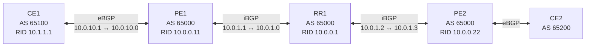
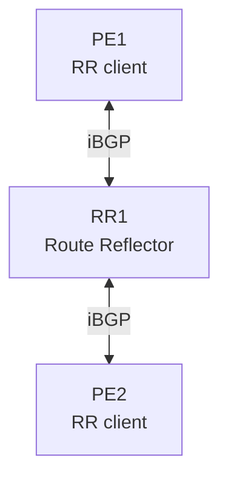

# BGP Unicast — Topology

## Topology Diagram



---

## Routers

| Node | AS | Role | Router ID |
|---|---:|---|---|
| CE1 | 65100 | eBGP customer / route originator | 10.1.1.1 |
| PE1 | 65000 | eBGP + iBGP PE | 10.0.0.11 |
| RR1 | 65000 | Route Reflector | 10.0.0.1 |
| PE2 | 65000 | iBGP + eBGP PE | 10.0.0.22 |
| CE2 | 65200 | eBGP customer | — |

---

## BGP Relationships

```text
CE1 (65100)
     |
     | eBGP
     |
PE1 (65000)
     |
     | iBGP
     |
RR1 (65000)
     |
     | iBGP
     |
PE2 (65000)
     |
     | eBGP
     |
CE2 (65200)
```

RR1 has PE1 and PE2 configured as route-reflector clients.

---

## PE1 ↔ RR1

The point-to-point link uses `/31`.

```text
PE1: 10.0.1.1/31
RR1: 10.0.1.0/31
```

These two addresses belong to:

```text
10.0.1.0/31
```

A `/31` provides exactly two addresses and is commonly used for point-to-point links.

The important addresses here are:

```text
10.0.1.0  RR1
10.0.1.1  PE1
```

---

## RR1 ↔ PE2

```text
RR1: 10.0.1.2/31
PE2: 10.0.1.3/31
```

This is a different `/31`:

```text
10.0.1.2/31
```

So:

```text
10.0.1.0/31
    PE1 ↔ RR1

10.0.1.2/31
    RR1 ↔ PE2
```

RR1 therefore has two directly connected point-to-point networks.

---

## CE1 ↔ PE1

```text
CE1: 10.0.10.1/31
PE1: 10.0.10.0/31
```

Network:

```text
10.0.10.0/31
```

BGP session:

```text
CE1 10.0.10.1
        |
        | eBGP
        |
PE1 10.0.10.0
```

CE1 originates:

```text
10.1.1.1/32
```

using its loopback.

---

## Loopbacks

### CE1

```text
10.1.1.1/32
```

This is the route originated into BGP by:

```text
network 10.1.1.1/32
```

### PE1

```text
10.0.0.11/32
```

### RR1

```text
10.0.0.1/32
```

### PE2

```text
10.0.0.22/32
```

---

## Route Reflection

The iBGP topology is:



RR1 reflects routes between its clients.

A route learned from PE2 can be reflected toward PE1.

The reflected UPDATE can contain:

```text
ORIGINATOR_ID
CLUSTER_LIST
```

while preserving other BGP attributes according to normal BGP rules.

---

## Example Route Flow

CE1 originates:

```text
10.1.1.1/32
```

The route enters PE1 through eBGP.

PE1 advertises it into the AS 65000 iBGP fabric.

RR1 can reflect it to PE2.

Conceptually:

```text
CE1
 |
 | 10.1.1.1/32
 | NEXT_HOP = CE1
 v
PE1
 |
 | iBGP
 v
RR1
 |
 | reflected iBGP
 v
PE2
```

The exact NEXT_HOP seen at each stage depends on `next-hop-self` configuration.

---

## Recursive Next-Hop Example

One of the key observations from the lab was a BGP route like:

```text
10.0.0.22/32
    via 10.0.1.3 (recursive)
```

This means:

```text
BGP:
    destination = 10.0.0.22/32
    next-hop    = 10.0.1.3

Underlay:
    resolve 10.0.1.3
        |
        v
    outgoing interface / adjacency
```

The BGP peer that sent the UPDATE does not have to be the same address as the NEXT_HOP.

---

## Underlay Routes

The lab intentionally exposed the importance of underlay reachability.

If a BGP next hop is:

```text
10.0.1.3
```

the receiving router must have a usable route toward:

```text
10.0.1.3
```

That route can come from:

- connected
- static
- OSPF
- IS-IS
- BGP
- BGP labeled-unicast
- another routing mechanism

Without next-hop resolution, the BGP control-plane route does not necessarily become a usable forwarding route.

---

## Useful Interfaces

The Containerlab management network is separate from the lab's routing relationships.

The important data-plane links are:

```text
CE1 ↔ PE1
PE1 ↔ RR1
RR1 ↔ PE2
PE2 ↔ CE2
```

The management network provides access to the containers but should not be confused with the intended BGP topology.

---

## Failure / Observation Points

Useful places to capture traffic:

### CE1 ↔ PE1

Observe:

```text
TCP/179
OPEN
UPDATE
KEEPALIVE
NOTIFICATION
```

The UPDATE originating CE1 contains:

```text
10.1.1.1/32
AS_PATH = 65100
NEXT_HOP = 10.0.10.1
ORIGIN = IGP
```

### PE1 ↔ RR1

Observe:

- iBGP OPEN
- iBGP UPDATE
- next-hop behavior
- `next-hop-self`
- route acceptance / policy
- route reflection

### RR1 ↔ PE2

Observe:

- reflected routes
- ORIGINATOR_ID
- CLUSTER_LIST
- preserved AS_PATH
- next-hop behavior

---

## Key Addresses

```text
CE1 loopback:   10.1.1.1/32
PE1 loopback:   10.0.0.11/32
RR1 loopback:   10.0.0.1/32
PE2 loopback:   10.0.0.22/32

CE1-PE1:
    CE1 = 10.0.10.1/31
    PE1 = 10.0.10.0/31

PE1-RR1:
    PE1 = 10.0.1.1/31
    RR1 = 10.0.1.0/31

RR1-PE2:
    RR1 = 10.0.1.2/31
    PE2 = 10.0.1.3/31
```

---

## Lab Goal

The core packet / route flow to keep in mind is:

```text
BGP route
   |
   | destination + attributes + NEXT_HOP
   v
BGP best path
   |
   v
recursive next-hop lookup
   |
   v
underlay route
   |
   v
interface / adjacency
   |
   v
FIB
   |
   v
packet
```

The BGP topology and the forwarding topology are related, but they are not required to be identical.
