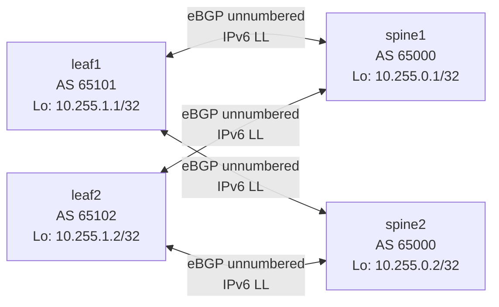

# BGP Unnumbered Lab — Topology

## Topology diagram



## Devices

| Device | Role | AS | Loopback |
|---|---|---:|---|
| spine1 | Spine | 65000 | `10.255.0.1/32` |
| spine2 | Spine | 65000 | `10.255.0.2/32` |
| leaf1 | Leaf | 65101 | `10.255.1.1/32` |
| leaf2 | Leaf | 65102 | `10.255.1.2/32` |

## Links

There are four point-to-point BGP links.

No IPv4 address is assigned to the physical links.

### leaf1 ↔ spine1

```text
leaf1 eth1
    IPv6 link-local
        ↕
spine1 eth1
    IPv6 link-local
```

BGP:

```text
leaf1 AS 65101
        ↕ eBGP
spine1 AS 65000
```

### leaf1 ↔ spine2

```text
leaf1 eth2
    IPv6 link-local
        ↕
spine2 eth1
    IPv6 link-local
```

BGP:

```text
leaf1 AS 65101
        ↕ eBGP
spine2 AS 65000
```

### leaf2 ↔ spine1

```text
leaf2 eth1
    IPv6 link-local
        ↕
spine1 eth2
    IPv6 link-local
```

BGP:

```text
leaf2 AS 65102
        ↕ eBGP
spine1 AS 65000
```

### leaf2 ↔ spine2

```text
leaf2 eth2
    IPv6 link-local
        ↕
spine2 eth2
    IPv6 link-local
```

BGP:

```text
leaf2 AS 65102
        ↕ eBGP
spine2 AS 65000
```

---

# Addressing model

## Loopbacks

The loopbacks provide stable BGP router identifiers and advertised host routes.

```text
spine1  10.255.0.1/32
spine2  10.255.0.2/32

leaf1   10.255.1.1/32
leaf2   10.255.1.2/32
```

## Physical links

The physical BGP links are IPv4-unnumbered.

They rely on automatically generated IPv6 link-local addresses:

```text
fe80::/64
```

There is therefore no topology such as:

```text
10.0.1.0/31
10.0.1.2/31
```

on these links.

Instead:

```text
interface
   |
   +-- IPv6 link-local
   |
   +-- ND neighbor discovery
   |
   +-- BGP unnumbered
```

---

# Neighbor discovery

Each unnumbered link has:

```text
local IPv6 link-local
        ↕
IPv6 ND
        ↕
remote IPv6 link-local
        ↕
remote MAC
```

Example neighbor state observed in the lab:

```text
fe80::... dev eth1 lladdr aa:c1:ab:... router STALE
```

The ND neighbor cache is therefore part of the forwarding machinery supporting the unnumbered BGP session.

---

# Route exchange

Each leaf advertises its loopback:

```text
leaf1:
10.255.1.1/32

leaf2:
10.255.1.2/32
```

Each spine learns both leaf loopbacks.

For example, spine1 receives:

```text
10.255.1.1/32
    next hop = leaf1's IPv6 link-local

10.255.1.2/32
    next hop = leaf2's IPv6 link-local
```

The spine then advertises the learned routes to its other eBGP neighbors.

---

# ECMP observation

leaf1 can learn leaf2's loopback through both spines:

```text
leaf1
  |
  +---- spine1 ----+
  |                |
  +---- spine2 ----+
                   |
                 leaf2
```

The two BGP paths can be multipath/ECMP eligible.

Example:

```text
10.255.1.2/32

Path 1:
65000 65102
next hop = spine1 link-local

Path 2:
65000 65102
next hop = spine2 link-local
```

FRR displayed one as:

```text
best (Router ID)
```

and the other as:

```text
multipath
```

---

# Failure experiment

To observe failover:

1. Identify the two BGP paths to a leaf loopback.
2. Shut one physical link.
3. Observe the BGP session disappear.
4. Capture the resulting UPDATE.
5. Observe `MP_UNREACH_NLRI`.
6. Inspect the BGP table again.
7. Confirm the remaining path is now best.

Expected conceptual flow:

```text
link failure
    ↓
BGP session/path failure
    ↓
route withdrawal
    ↓
MP_UNREACH_NLRI
    ↓
BGP recalculates
    ↓
alternate path selected
    ↓
forwarding continues through other spine
```

---

# Packet captures to inspect

Capture TCP/179:

```text
tcpdump -ni any tcp port 179
```

Then inspect:

### OPEN

Look for:

```text
Multiprotocol Extensions
Extended Next Hop Encoding
Route Refresh
Enhanced Route Refresh
4-octet AS
Additional Paths
Graceful Restart
LLGR
```

### UPDATE

For unnumbered IPv4 BGP, look for:

```text
MP_REACH_NLRI
```

and inspect:

```text
AFI
SAFI
IPv6 next hop
IPv4 NLRI
```

### Withdrawal

Look for:

```text
MP_UNREACH_NLRI
```

and confirm:

```text
Withdrawn Routes Length = 0
```

when the withdrawal is being carried by MP_UNREACH_NLRI.

### Startup churn

A:

```text
NOTIFICATION
Cease
Connection Collision Resolution
```

can occur when simultaneous BGP/TCP connections need to be resolved.

---

# Topology mental model

```text
                 BGP CONTROL PLANE

       IPv4 loopback prefixes
                  |
                  v
       MP_REACH_NLRI / MP_UNREACH
                  |
                  v
        IPv6 link-local next hop
                  |
                  v
             IPv6 ND
                  |
                  v
               MAC
                  |
                  v
          Ethernet forwarding
```

The key architectural separation is:

```text
BGP:
    "This prefix is reachable through this next hop."

Routing / kernel:
    "I know how to reach that next hop."

ND:
    "This IPv6 neighbor corresponds to this MAC."

Ethernet:
    "Send the frame to that MAC."
```
